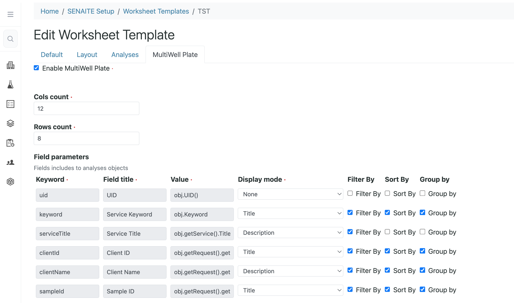

  

  <h3>Plan. Place. Perform.</h3>
  

## About

SENAITE.MULTIWELLPLATE is an add-on that provides a set of tools for labs that use multiwell plates in their daily routine analyses. It supports the full pipetting workflow: create plate templates with customizable pipetting and assignment rules, place samples and substances into the correct wells, print pipetting plans, and export layouts to instruments.

## Configure plate templates

Configuring plate templates is the first step in setting up your workflow. This section explains how to tailor plate templates to your routine. All configuration fields are available for any Worksheet Template object after the add-on is installed.

The Plate Template defines a set of rules that describe the plate configuration and specify how analyses are positioned on the plate.

### Create a new Worksheet Template

After installing the add-on, go to Setup > Worksheet Templates and click “Add.”

When creating a template, use a clear and descriptive name to help analysts select the correct one. It is recommended to include plate characteristics—such as dimensions or the number of wells—directly in the Worksheet Template title.

An additional tab will then become available, containing all plate-related details.

### Enabling MultiwellPlate option

Navigate to the Multiwell Plate tab and set the “Enable multiwell” checkbox to enabled.

  

Each worksheet created from this template becomes a “Platable” object, allowing analysts to assign analyses to wells.

### Setting up plate dimensions

Enter the number of rows and columns in the corresponding fields.

### Customs fields setup

Each of the enclosed fields is calculated and passed along with every Analysis object. You can also configure which fields are used as the title and description, as well as which values are used as sorting or grouping keys by analysts.

Each field can be configured as follows:

- “Display mode” — controls where the field value is displayed (title, description, or both).

- “FilterBy” — enables filtering of analyses by this field.

- “SortBy” — allows analyses to be sorted by this field in the Multiwell application.

- “GroupBy” — allows analyses to be grouped by this field. 

### Positioning rules

Here you can define the rules that determine whether analyses can be assigned to a particular well, whether multiple analyses can be assigned to the same well, or whether each analysis must be placed in the next available well.

These rules are evaluated each time you attempt to assign analyses to a well.

## Assign to wells

How it works for analyst

## Print pipetting plan

Print template

## Export to instrument 

How to use add-on in export interface